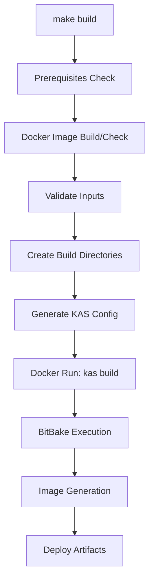

# KAS Board Building System

[](https://github.com/yourusername/builder)
[](LICENSE)

A professional, Docker-based Yocto/OpenEmbedded build system using KAS for multi-board embedded Linux development. Supports Raspberry Pi, Xilinx Zynq, NVIDIA Jetson, and NXP i.MX platforms.

## 🚀 Quick Start

### Prerequisites

- Docker (20.10+)
- Git
- Linux host (Ubuntu 20.04+ recommended)
- **Minimum 100GB free disk space**
- **8GB RAM** (16GB+ recommended for parallel builds)

### First Build (5 minutes to first image)

```bash
# 1. Clone the repository
git clone <your-repo-url>
cd builder

# 2. Set up bash completion (optional but recommended)
make setup-completion
source ~/.bashrc

# 3. Build your first image
make build raspberry-pi raspberrypi5 core-image-base

# 4. Find your artifacts
ls build/raspberry-pi-raspberrypi5/tmp/deploy/images/
```

### Build Variants

```bash
# Debug build (with symbols and debug tools)
make build raspberry-pi raspberrypi5 core-image-base BUILD_VARIANT=debug

# Release build (default, optimized)
make build raspberry-pi raspberrypi5 core-image-base BUILD_VARIANT=release

# Production build (hardened, read-only rootfs)
make build raspberry-pi raspberrypi5 core-image-base BUILD_VARIANT=production
```

## 📋 Table of Contents

- [Architecture Overview](#architecture-overview)
- [Supported Platforms](#supported-platforms)
- [Common Commands](#common-commands)
- [Configuration](#configuration)
- [Build System](#build-system)
- [Troubleshooting](#troubleshooting)
- [Advanced Usage](#advanced-usage)
- [Contributing](#contributing)

## 🏗️ Architecture Overview

```
builder/
├── Makefile                 # Main build orchestration
├── boards/                  # Board family configurations
│   ├── common.yml          # Shared configuration
│   ├── raspberry-pi/       # Raspberry Pi configs
│   ├── xilinx-zynq/        # Xilinx Zynq configs
│   ├── nvidia-jetson/      # NVIDIA Jetson configs
│   └── nxp-imx/           # NXP i.MX configs
├── docker/                  # Docker build environments
│   ├── Dockerfile          # Main builder image
│   ├── sdk/               # SDK container
│   └── esdk/              # eSDK container
├── scripts/                # Utility scripts
│   ├── validate-target.sh # Input validation
│   └── update-repos.sh    # Git repo management
├── build/                  # Build outputs (gitignored)
├── sources/               # Source repositories (gitignored)
├── shared/                # Shared caches (gitignored)
│   ├── downloads/         # Package downloads (shared)
│   └── sstate-cache/      # Shared state cache (per-arch)
└── artifacts/             # Collected build artifacts
```

### Key Design Principles

1. **Isolation**: Docker containers provide reproducible build environments
2. **Shared Caching**: Downloads and sstate shared across all builds (save bandwidth/time)
3. **Architecture Segregation**: SSTATE caches separated by family-architecture
4. **Parameterized Configs**: Single template per family, machine/target substituted at runtime

## 🖥️ Supported Platforms

### Raspberry Pi
**Family:** `raspberry-pi`

| Machine | Architecture | Notes |
|---------|--------------|-------|
| raspberrypi5 | aarch64 | Latest, best performance |
| raspberrypi4-64 | aarch64 | Popular choice |
| raspberrypi3-64 | aarch64 | Good for development |
| raspberrypi4 | arm | 32-bit variant |
| ... | ... | See `boards/raspberry-pi/.machines` |

**Popular Targets:**
- `core-image-base` - Basic console image
- `rpi-image-ros2` - ROS 2 development
- `rpi-image-vision` - Computer vision stack
- `rpi-image-iot` - IoT connectivity

[View Full Documentation](boards/raspberry-pi/README.md)

### Xilinx Zynq/ZynqMP/Versal
**Family:** `xilinx-zynq`

Supports Zynq-7000, ZynqMP (UltraScale+), Versal platforms with PetaLinux distribution.

| Machine | Architecture | SoC Family |
|---------|--------------|------------|
| zynqmp-zcu102 | aarch64 | ZynqMP Evaluation |
| zynq-zc702 | arm | Zynq-7000 Evaluation |
| versal-vck190 | aarch64 | Versal AI Core |
| kria-kv260 | aarch64 | Kria SOM |

[View Full Documentation](boards/xilinx-zynq/README.md)

### NVIDIA Jetson
**Family:** `nvidia-jetson`

AI/ML edge computing platforms with CUDA support.

| Machine | Architecture | GPU |
|---------|--------------|-----|
| jetson-agx-orin-devkit | aarch64 | Ampere (2048 CUDA cores) |
| jetson-orin-nano-devkit | aarch64 | Ampere (1024 CUDA cores) |
| jetson-xavier-nx-devkit | aarch64 | Volta |

[View Full Documentation](boards/nvidia-jetson/README.md)

### NXP i.MX
**Family:** `nxp-imx`

Industrial-grade processors with real-time capabilities.

[View Full Documentation](boards/nxp-imx/README.md)

## 🎯 Common Commands

### List Available Options
```bash
make list              # Show all families, machines, and targets
make info              # Show build system status and cache sizes
make version           # Show version information
```

### Building

```bash
# Standard build
make build <family> <machine> <target>

# Examples
make build raspberry-pi raspberrypi5 core-image-base
make build xilinx-zynq zynqmp-zcu102 petalinux-image-minimal
make build nvidia-jetson jetson-agx-orin-devkit core-image-base

# Performance tuning
make build raspberry-pi raspberrypi5 core-image-base \
  BB_NUMBER_THREADS=8 \
  PARALLEL_MAKE="-j 8" \
  RM_WORK=0
```

### SDK Development

```bash
# Build SDK (for cross-compilation)
make sdk raspberry-pi raspberrypi5 core-image-base

# Build eSDK (extensible SDK, for custom image development)
make esdk raspberry-pi raspberrypi5 core-image-base

# Interactive build shell (for debugging)
make shell raspberry-pi raspberrypi5 core-image-base
```

### Artifact Management

```bash
# Collect build artifacts to artifacts/ directory
make collect-artifacts raspberry-pi-raspberrypi5

# Clean specific build
make clean raspberry-pi-raspberrypi5

# Clean all builds
make clean-all

# Clean shared caches (saves disk space, loses build acceleration)
make clean-shared
make clean-downloads      # Only downloads
make clean-sstate         # Only sstate
make clean-sstate-family raspberry-pi  # Family-specific sstate
```

### Configuration

```bash
# Show current configuration
make config

# View build configuration options
make help
```

## ⚙️ Configuration

### Build Variants

| Variant | Use Case | Features |
|---------|----------|----------|
| `debug` | Development | Debug symbols, extra logging, development tools |
| `release` | Default | Optimized, balanced for size/performance |
| `production` | Deployment | Hardened security, read-only rootfs, minimal footprint |

### Performance Tuning

```bash
# .builderrc (optional, create in project root)
BUILD_VARIANT=release
BB_NUMBER_THREADS=12
PARALLEL_MAKE=-j 12
RM_WORK=1
```

**Environment Variables:**
- `BUILD_VARIANT`: debug|release|production
- `BB_NUMBER_THREADS`: BitBake parallel tasks (default: nproc)
- `PARALLEL_MAKE`: Make parallel jobs (default: -j nproc)
- `RM_WORK`: Remove work files after build (1=yes, 0=no)

**Proxy Support:**
```bash
export HTTP_PROXY=http://proxy.example.com:3128
export HTTPS_PROXY=http://proxy.example.com:3128
export NO_PROXY=localhost,127.0.0.1
make build raspberry-pi raspberrypi5 core-image-base
```

### Cache Strategy

**Downloads Cache** (`shared/downloads/`):
- Shared across ALL families and architectures
- Contains source tarballs, git repos, etc.
- Can grow to 50GB+

**SSTATE Cache** (`shared/sstate-cache/<family>-<arch>/`):
- Architecture-specific (arm vs aarch64)
- Family-specific (different BSP layers)
- Most effective build accelerator
- Can grow to 100GB+ per family-arch

**Best Practices:**
- Keep caches on fast SSD storage
- Monitor cache sizes with `make info`
- Periodically clean old/unused builds
- Consider remote cache mirrors for CI/CD

## 🔧 Build System

### Build Flow



### Directory Structure After Build

```
build/raspberry-pi-raspberrypi5/
├── cache/               # BitBake cache
├── conf/               # Generated configuration
├── tmp/
│   ├── deploy/
│   │   ├── images/     # 📦 Bootable images HERE
│   │   ├── sdk/        # SDK installers
│   │   └── licenses/   # License manifests
│   ├── log/            # Build logs
│   └── work/           # Build work (large, cleaned if RM_WORK=1)
└── ...

sources/raspberry-pi/
├── poky/               # Yocto core
├── meta-raspberrypi/   # BSP layer
├── meta-openembedded/  # Community layers
└── meta-soc-rpi/      # Custom layers
```

## 🐛 Troubleshooting

### Common Issues

#### 1. "No space left on device"

```bash
# Check disk usage
df -h
make info  # Shows cache sizes

# Clean old builds
make clean-all

# Clean caches (will slow next build)
make clean-shared
```

**Prevention:** Reserve 150GB+ for serious development

#### 2. Docker permission denied

```bash
# Add user to docker group
sudo usermod -aG docker $USER

# Log out and back in, or:
newgrp docker
```

#### 3. Build fails with "Fetch failure"

**Causes:** Network issues, repo moved, authentication

```bash
# Check connectivity
ping github.com

# Retry build (uses cached work)
make build <same-args>

# Clean failed task cache
rm -rf build/<family>-<machine>/tmp/work/*/temp/
```

#### 4. "Machine not supported"

```bash
# Check available machines for family
make list

# Verify spelling (case-sensitive)
cat boards/<family>/.machines
```

#### 5. Build hangs or is extremely slow

```bash
# Check resources
htop  # CPU usage
free -h  # Memory usage
iotop  # Disk I/O

# Reduce parallelism
make build <family> <machine> <target> BB_NUMBER_THREADS=4 PARALLEL_MAKE="-j 4"

# Disable work removal (faster, but uses more space)
make build <family> <machine> <target> RM_WORK=0
```

#### 6. "yml_file: No such file or directory"

This indicates the board configuration is missing or path is incorrect.

```bash
# Verify board config exists
ls boards/<family>/<family>.yml

# Check for typos in family name
make list
```

### Debug Mode

```bash
# Verbose build with debug symbols
make build raspberry-pi raspberrypi5 core-image-base BUILD_VARIANT=debug

# Interactive shell for manual debugging
make shell raspberry-pi raspberrypi5 core-image-base

# Inside shell:
bitbake -c listtasks core-image-base  # Show available tasks
bitbake -e core-image-base | less     # Show all variables
bitbake -g core-image-base            # Generate dependency graph
```

### Log Analysis

```bash
# Build logs location
build/<family>-<machine>/tmp/log/cooker/<machine>/

# Find errors in latest build
grep -r "ERROR" build/<family>-<machine>/tmp/log/

# Task-specific logs
ls build/<family>-<machine>/tmp/work/*/*/temp/
```

### Getting Help

1. Check documentation in `boards/<family>/README.md`
2. Review BitBake logs in `build/*/tmp/log/`
3. Search Yocto/OpenEmbedded mailing lists
4. File an issue with:
   - Command you ran
   - Error message
   - Output of `make info`
   - Relevant log excerpts

## 🚀 Advanced Usage

### Custom Layers

Add your own meta-layers to board configurations:

```yaml
# boards/raspberry-pi/raspberry-pi.yml
repos:
  meta-custom:
    url: https://github.com/yourorg/meta-custom
    branch: main
    path: sources/raspberry-pi/meta-custom
```

### CI/CD Integration

```yaml
# .github/workflows/build.yml
name: Build Image
on: [push]
jobs:
  build:
    runs-on: ubuntu-latest
    steps:
      - uses: actions/checkout@v3
      - name: Build
        run: |
          make build raspberry-pi raspberrypi5 core-image-base
      - name: Collect Artifacts
        run: make collect-artifacts raspberry-pi-raspberrypi5
      - uses: actions/upload-artifact@v3
        with:
          name: images
          path: artifacts/
```

### Multi-Board Batch Builds

```bash
#!/bin/bash
# build-all-rpi.sh
BOARDS=("raspberrypi4-64" "raspberrypi5")
TARGET="core-image-base"

for board in "${BOARDS[@]}"; do
  make build raspberry-pi "$board" "$TARGET" || echo "Failed: $board"
done
```

### Remote Cache Mirror

```yaml
# boards/common.yml - Add to local_conf_header
remote_sstate: |
  SSTATE_MIRRORS = "file://.* http://sstate-cache.example.com/PATH"
```

## 🤝 Contributing

See [CONTRIBUTING.md](CONTRIBUTING.md) for:
- Code style guidelines
- Pull request process
- Testing requirements
- Board support addition guide

### Adding a New Board Family

1. Create `boards/<family>/<family>.yml` (use existing as template)
2. Create `boards/<family>/.machines` (list of supported machines)
3. Create `boards/<family>/.targets` (list of supported targets)
4. Create `boards/<family>/.arch-map` (machine to architecture mapping)
5. Create `boards/<family>/README.md` (family-specific docs)
6. Update main Makefile help text
7. Test thoroughly and submit PR

## 📊 Performance Tips

### First Build vs Subsequent Builds

| Scenario | Time (Raspberry Pi 5, core-image-base) |
|----------|----------------------------------------|
| First build (cold caches) | 3-5 hours |
| Rebuild (warm caches) | 5-15 minutes |
| Clean rebuild (sstate only) | 30-60 minutes |

### Optimization Strategies

1. **Use SSDs**: 3-5x faster than HDDs
2. **More RAM**: Reduce swapping (16GB+ ideal)
3. **Faster CPUs**: BitBake is CPU-bound
4. **Keep caches**: Don't clean unless necessary
5. **Incremental builds**: Avoid `clean-all` when possible

### Resource Estimates

| Board Family | Build Time | Disk Space | RAM |
|--------------|------------|------------|-----|
| Raspberry Pi | 2-4 hours | 80GB | 8GB |
| Xilinx Zynq | 4-6 hours | 120GB | 16GB |
| NVIDIA Jetson | 3-5 hours | 100GB | 12GB |
| NXP i.MX | 3-5 hours | 90GB | 8GB |

## 📝 License

[Specify your license here - MIT, Apache 2.0, etc.]

## 🙏 Acknowledgments

- [KAS](https://github.com/siemens/kas) - Setup tool for BitBake based projects
- [Yocto Project](https://www.yoctoproject.org/)
- [OpenEmbedded](https://www.openembedded.org/)
- Board-specific BSP maintainers

## 📞 Support

- Documentation: See `boards/*/README.md` for family-specific guides
- Issues: [GitHub Issues](https://github.com/yourorg/builder/issues)
- Discussions: [GitHub Discussions](https://github.com/yourorg/builder/discussions)

---

**Built with ❤️ for embedded Linux developers**
